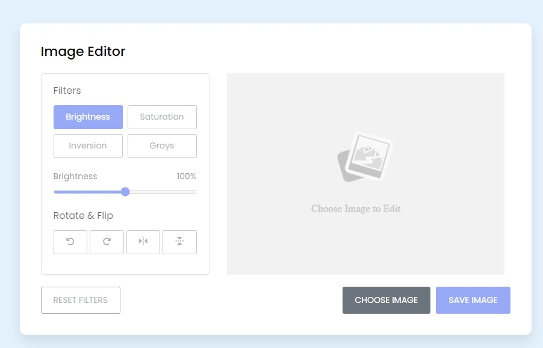
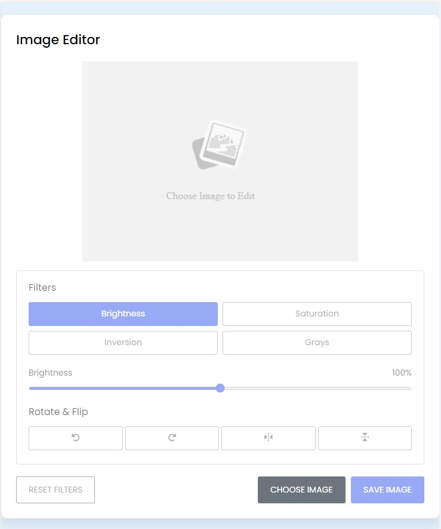
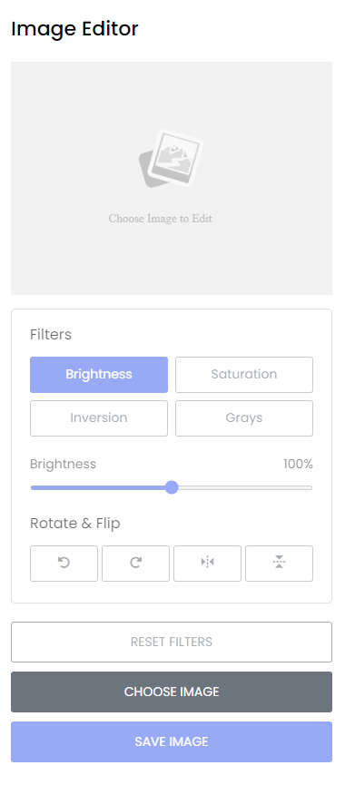
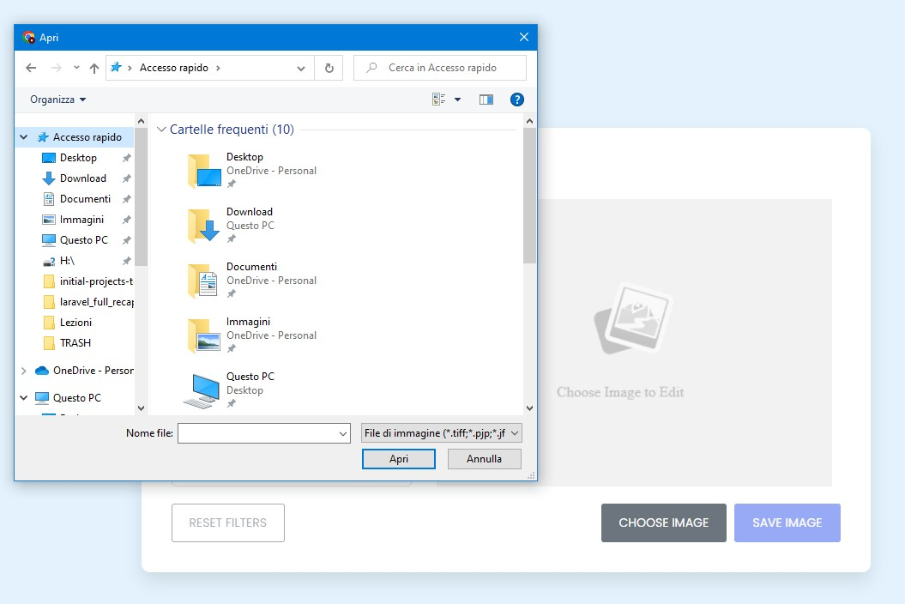
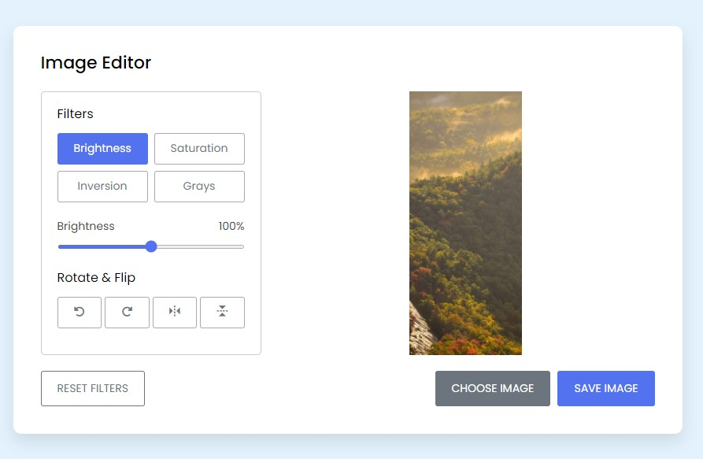
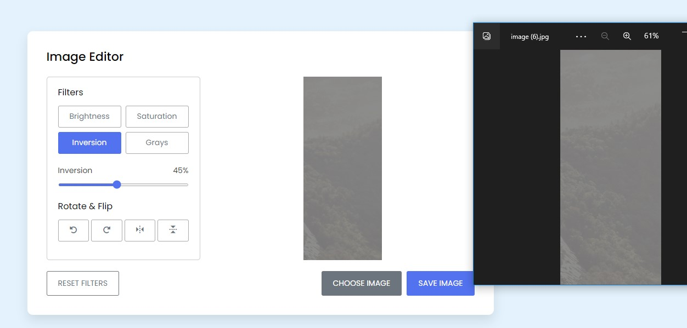

# Progetto Javascript Image Editor

Progetto di media complessità di un editor per immagini, completamente responsive, con lo scopo di :

- Modificare luminosità dell'immagine
- Modificare saturazione e inversione dei colori
- Aumentare la scala di grigi dell'immagine

Oltre ai filtri sono stati implementati dei button per :

- Ruotare l'immagine di +/- 90°
- Specchiarla sull'asse orizzontale e verticale

Condizione iniziale dell'app con bottoni disabilitati poichè in assenza di un'immagine da editare

Versione del sito responsive (Tablet mode)

Versione del sito responsive (Mobile mode)

Attivazione del pulsante e ricerca dell'immagine all'interno delle cartelle locali utente

Attivazione di tutti i pulsanti dato che il sito ha rilevato l'immagine. Il primo tasto attivo solitamente è la luminosità (ma al click la classe active cambia in base al pulsante cliccato). i filtri sono regolati tramite un input range (diverso per ogni sezione di filtro) e vi è la possibilità di resettare anche i filtri.

Una volta applicato i vari filtri alla mia immagine, cliccando sul tasto "save image" avvia il download dell'immagine modificata e permette all'utente di salvarla nelle sue cartelle locali.

